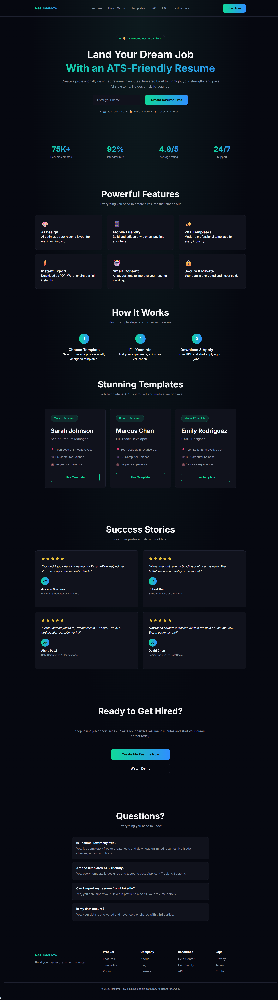

# ResumeFlow – Resume Builder Landing Page

A modern, responsive landing page for an imaginary resume builder product called **ResumeFlow**. This project was built using **HTML, CSS, and a small amount of JavaScript** as part of a frontend assignment.

## 🚀 Live Demo

https://ayushthinks.github.io/resume-landing/


## ✨ Features

- Responsive design for desktop, tablet, and mobile
- Dark modern UI
- Professional landing page layout
- Hero section with call-to-action
- Statistics section
- Features section
- How It Works section
- Resume template cards
- Testimonials
- FAQ section
- Footer with useful links
- Dynamic footer year using JavaScript

---

## 🛠️ Technologies Used

- HTML5
- CSS3
- JavaScript (ES6)

---

## 📁 Project Structure

```text
resume-landing/
│── index.html
│── style.css
│── script.js
│── README.md
└── screenshots/
```

---

## 📸 Preview

Example:





---

## 📱 Responsive Design

The landing page is fully responsive and optimized for:

- Desktop
- Tablet
- Mobile

---

## 📌 JavaScript

A small amount of JavaScript is used to update page content dynamically using `querySelector()` and `textContent()`.

Example:

- Dynamic footer year

---

## 🎯 Learning Outcomes

- Semantic HTML
- Modern CSS Layout (Flexbox & Grid)
- Responsive Web Design
- CSS Variables
- Component-based UI
- Basic DOM Manipulation

---

## 👨‍💻 Author

**Ayush Joshi**
